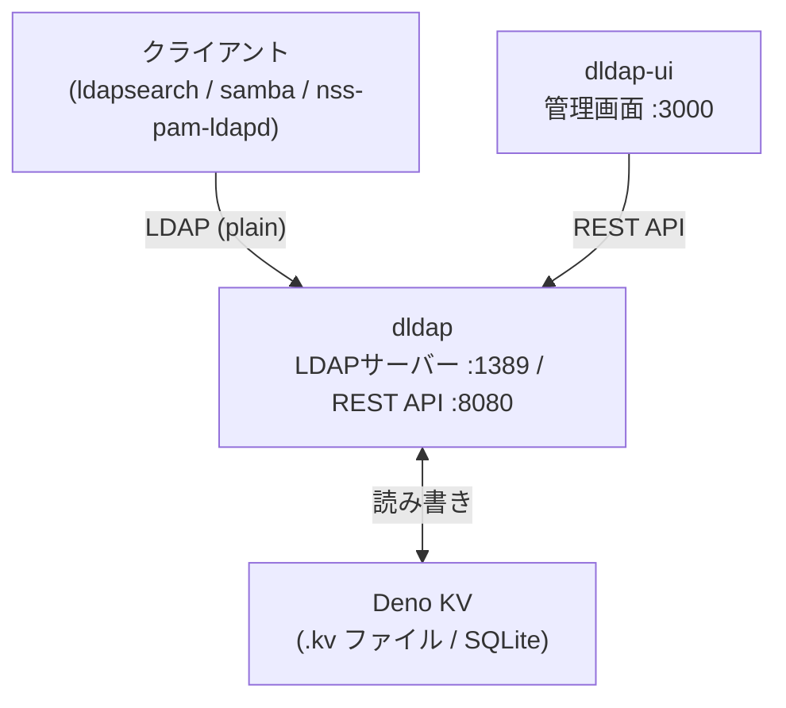
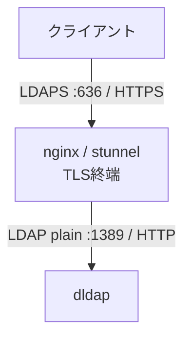

# dldap

Deno製の軽量LDAPサーバー。Samba（Windows認証）サポートとREST APIを内蔵しています。

> **Beta** — 破壊的変更が入る可能性があります。

## 特徴

- **外部依存なし** — Deno標準ライブラリのみ使用
- **Deno KV** によるデータ永続化（SQLite使用）
- **Samba対応** — sambaNTPassword / sambaLMPassword の自動生成、sambaGroupMapping の自動付与
- **POSIX対応** — uidNumber / gidNumber の自動採番、homeDirectory / loginShell の自動補完
- **REST API** — ユーザー・グループ・OUをHTTP経由で管理
- **Web UI** — Deno Fresh製の管理画面を同梱

## アーキテクチャ



TLS（LDAPS/HTTPS）が必要な場合は、nginxやstunnelをフロントに置いてTLS終端します。

## クイックスタート

```bash
cp .env.example .env
# .env を編集して LDAP_ADMIN_PW などを設定

docker compose up -d
```

- LDAP: `ldap://localhost:1389`
- REST API: `http://localhost:8080`
- 管理UI: `http://localhost:3000`

## 環境変数

### LDAP

| 変数            | デフォルト                   | 説明                 |
| --------------- | ---------------------------- | -------------------- |
| `LDAP_PORT`     | `389`                        | LDAPリスンポート     |
| `LDAP_HOST`     | `0.0.0.0`                    | LDAPバインドアドレス |
| `LDAP_BASE_DN`  | `dc=example,dc=com`          | ベースDN             |
| `LDAP_ADMIN_DN` | `cn=admin,dc=example,dc=com` | 管理者DN             |
| `LDAP_ADMIN_PW` | (必須)                       | 管理者パスワード     |
| `LDAP_KV_PATH`  | `/data/dldap.kv`             | Deno KVファイルパス  |

### Samba

| 変数              | デフォルト  | 説明                                        |
| ----------------- | ----------- | ------------------------------------------- |
| `SAMBA_ENABLED`   | `true`      | Sambaサポートの有効化                       |
| `SAMBA_DOMAIN`    | `WORKGROUP` | NetBIOSドメイン名                           |
| `SAMBA_AUTO_HASH` | `true`      | パスワード変更時にsambaNTPasswordを自動生成 |
| `SAMBA_LM_HASH`   | `false`     | sambaLMPassword生成（非推奨・脆弱）         |

> Domain
> SID（`S-1-5-21-...`）は初回起動時に自動生成・KVへ保存されます。管理UIのStatusページから確認・変更できます。

### POSIX

| 変数                  | デフォルト  | 説明                      |
| --------------------- | ----------- | ------------------------- |
| `POSIX_UID_START`     | `1000`      | UID自動採番の開始値       |
| `POSIX_GID_START`     | `1000`      | GID自動採番の開始値       |
| `POSIX_HOME_BASE`     | `/home`     | homeDirectoryのベースパス |
| `POSIX_DEFAULT_SHELL` | `/bin/bash` | デフォルトloginShell      |

### API / UI

| 変数                      | デフォルト          | 説明                     |
| ------------------------- | ------------------- | ------------------------ |
| `API_PORT`                | `8080`              | REST APIリスンポート     |
| `API_HOST`                | `0.0.0.0`           | REST APIバインドアドレス |
| `API_SESSION_TTL_SECONDS` | `3600`              | セッション有効期限（秒） |
| `CORS_ORIGIN`             | `*`                 | CORS許可オリジン         |
| `API_BASE_URL`            | `http://dldap:8080` | UIからAPIへの接続先      |

## REST API

認証が必要なエンドポイントにはBearerトークンが必要です（`POST /api/auth` で取得）。

| メソッド | パス                           | 説明                     |
| -------- | ------------------------------ | ------------------------ |
| `POST`   | `/api/auth`                    | ログイン（トークン取得） |
| `DELETE` | `/api/auth`                    | ログアウト               |
| `GET`    | `/api/status`                  | サーバー情報・Domain SID |
| `PUT`    | `/api/status/sid`              | Domain SIDの更新         |
| `GET`    | `/api/users`                   | ユーザー一覧             |
| `POST`   | `/api/users`                   | ユーザー作成             |
| `GET`    | `/api/users/:uid`              | ユーザー取得             |
| `PUT`    | `/api/users/:uid`              | ユーザー更新             |
| `DELETE` | `/api/users/:uid`              | ユーザー削除             |
| `PUT`    | `/api/users/:uid/password`     | パスワード変更           |
| `GET`    | `/api/groups`                  | グループ一覧             |
| `POST`   | `/api/groups`                  | グループ作成             |
| `GET`    | `/api/groups/:cn`              | グループ取得             |
| `PUT`    | `/api/groups/:cn`              | グループ更新             |
| `DELETE` | `/api/groups/:cn`              | グループ削除             |
| `POST`   | `/api/groups/:cn/members`      | メンバー追加             |
| `DELETE` | `/api/groups/:cn/members/:uid` | メンバー削除             |
| `GET`    | `/api/ous`                     | OU一覧                   |
| `POST`   | `/api/ous`                     | OU作成                   |
| `DELETE` | `/api/ous/:ou`                 | OU削除                   |

## Deno（ライブラリとして使用）

```ts
import { createServer, defaultConfig, KvStore } from "jsr:@gazf/dldap";

const store = await KvStore.open("./my.kv");
const server = createServer({ ...defaultConfig, adminPassword: "secret" }, store);
await server.serve();
```

## TLS（LDAPS）の構成例

dldap自体はplain LDAPのみ提供します。TLS終端にはnginxやstunnelを使用してください。



## ライセンス

MIT
